<h1 align="center">¡Hola! Soy StringBuilder777 👋</h1>

  

  <strong>Full-Stack Developer · Saltillo, México</strong> 
  Instituto Tecnológico de Saltillo · Roceel

  
  
  

---

## Sobre mí

Construyo software full-stack con especial cuidado por la arquitectura, la experiencia de usuario y la mantenibilidad.

- 🌐 Desarrollo productos web de extremo a extremo.
- 🧩 Me gusta convertir problemas complejos en sistemas claros y escalables.
- 🦀 Exploro Rust para herramientas rápidas, seguras y cercanas al sistema.
- 🌱 Mantengo una mentalidad de aprendizaje continuo.
- 🤝 Disfruto colaborar, documentar y compartir lo aprendido.

## Proyectos destacados

- **[SynchroCode](https://github.com/StringBuilder777/SynchroCode)** — Gestión de proyectos y equipos con autenticación, colaboración y una interfaz moderna.  
  [`Demo en vivo`](https://synchro-code.vercel.app) · `Astro 5` · `React 19` · `TypeScript` · `Supabase` · `Quarkus`

- **[BuilderNet](https://github.com/StringBuilder777/BuilderNet)** — Monitor de red interactivo para terminal con multiping, descubrimiento ARP y visualización de topología.  
  `Rust` · `Ratatui` · `Crossterm` · `macOS` · `Linux`

- **[BusTicket](https://github.com/StringBuilder777/Busticket)** — Sistema de venta y gestión de boletos de autobús con roles, selector de asientos y panel administrativo.  
  `Java 23` · `JavaFX 24` · `MySQL` · `Maven` · `MVC`

## Stack tecnológico

  <strong>Lenguajes</strong>

  

  <strong>Frontend y backend</strong>

  

  <strong>Datos, nube y herramientas</strong>

  

## Actividad en GitHub

  
  

  Los lenguajes se calculan a partir del código público y no representan por sí solos el nivel de dominio.

  

  
<strong>Ver racha de contribuciones 🔥</strong>

   
  

    
  

## Mi calendario, pero con más personalidad

  <picture>
    <source media="(prefers-color-scheme: dark)" srcset="./assets/contribution-snake-dark.svg"/>
    <source media="(prefers-color-scheme: light)" srcset="./assets/contribution-snake.svg"/>
    
  </picture>

  
<strong>Un poco de caos controlado 🃏</strong>

   
  

    
  

---

  <a href="https://stringbuilder.tech"><strong>Portafolio</strong></a>
  ·
  <a href="https://github.com/StringBuilder777?tab=repositories"><strong>Repositorios</strong></a>

  Construyendo, aprendiendo y mejorando un commit a la vez.

